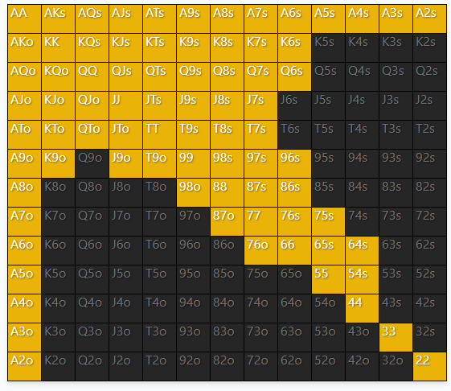
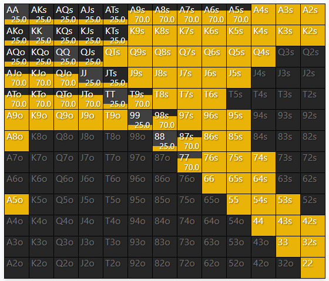

# Button open vs Big Blind Call
The ranges of the players are from personal experience and not GTO. I tried to reflect what i encountered so far in
my journey through the micro stakes will be the following:

## BTN range
[]
22+,A2+,K6s+,K9o+,Q6s+,QTo+,J7s+,J9o+,T7s+,T9o,96s+,98o,86s+,87o,75s+,76o,64s+,54s

## BB range
[]

Note that the top of range of big blind is discounted, because we expect a 3-bet at a high frequency.

## Board #1 Qh 3h 2s 7c 4c

